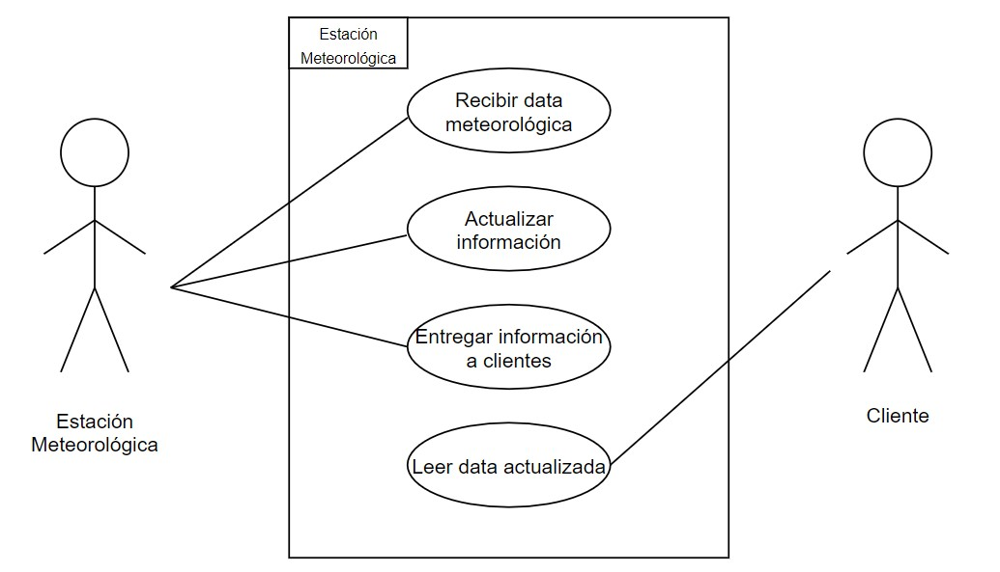

# Requerimientos Funcionales
1. Todo cliente debe poder tener información actualizada sobre la temperatura, humedad y viento.
2. La información debe ser actualizada a los clientes al recibirla.
3. Se deben poder agregar clientes.

# Requerimientos No Funcionales

1. El programa deberá funcionar con 0 clientes.
2. El programa deberá soportar 50 clientes.
3. La estación meteorológica debería recibir nueva información cada minuto.

# Casos de Uso

1. El sistema recibe la información metereológica de los sensores.
2. El sistema debe actualizar la información.
3. El sistema entrega la información a los clientes.
4. El cliente puede leer la información actualizada.

# Diagrama de Casos de Uso

